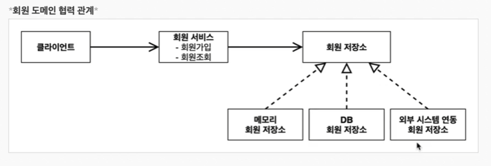
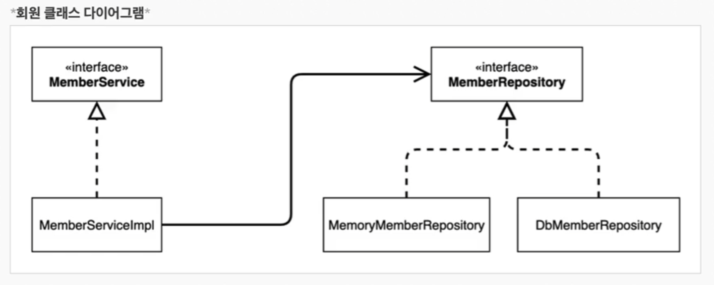

## 비즈니스 요구사항과 설계

- 회원
  - 회원을 가입하고 조회할 수 있다.
  - 회원은 일반과 VIP 두 가지 등급이 있다.
  - 회원 데이터는 자체 DB를 구축할 수 있고 외부 시스템과 연동할 수 있다.(미확정)

- 주문과 할인 정책
  - 회원은 상품을 주문할 수 있다.
  - 회원 등급에 따라 할인 정책을 적용할 수 있다.
  - 할인 정책은 모든 VIP는 1000원을 할인해주는 고정 금액 할인을 적용해달라(나중에 변경될 수 있다.)
  - 할인 정책은 변경 가능성이 높다. 회사의 기본 할인 정책을 아직 정하지 못했고, 오픈 직전까지 고민을 미루고 싶다. 최악의 경우 할인을 적용하지 않을 수도 있다.(미확정)

---

##### 관심사의 분리

클라이언트인 OrderServiceImpl에서 discount Rate를 실제 구현체를 함께 의존하기 때문에 OCP, DIP 원칙 위배하게 된다.(할인 정책을 바꾸려면 오더서비스 임플의 코드가 변경된다.)

이를 해결하기 위해 클라이언트에서는 인터페이스(discountPolicy)만 의존하고 자동으로 구현객체를 생성하고 연결하는 별도의 설정 클래스를 만든다.

이것이 바로 AppConfig!

- AppConfig는 애플리케이션의 실제 동작에 필요한 구현객체를 생성한다.

- AppConfig는 생성한 객체 인스턴스의 참조를 생성자를 통해서 주입(연결)해준다.

